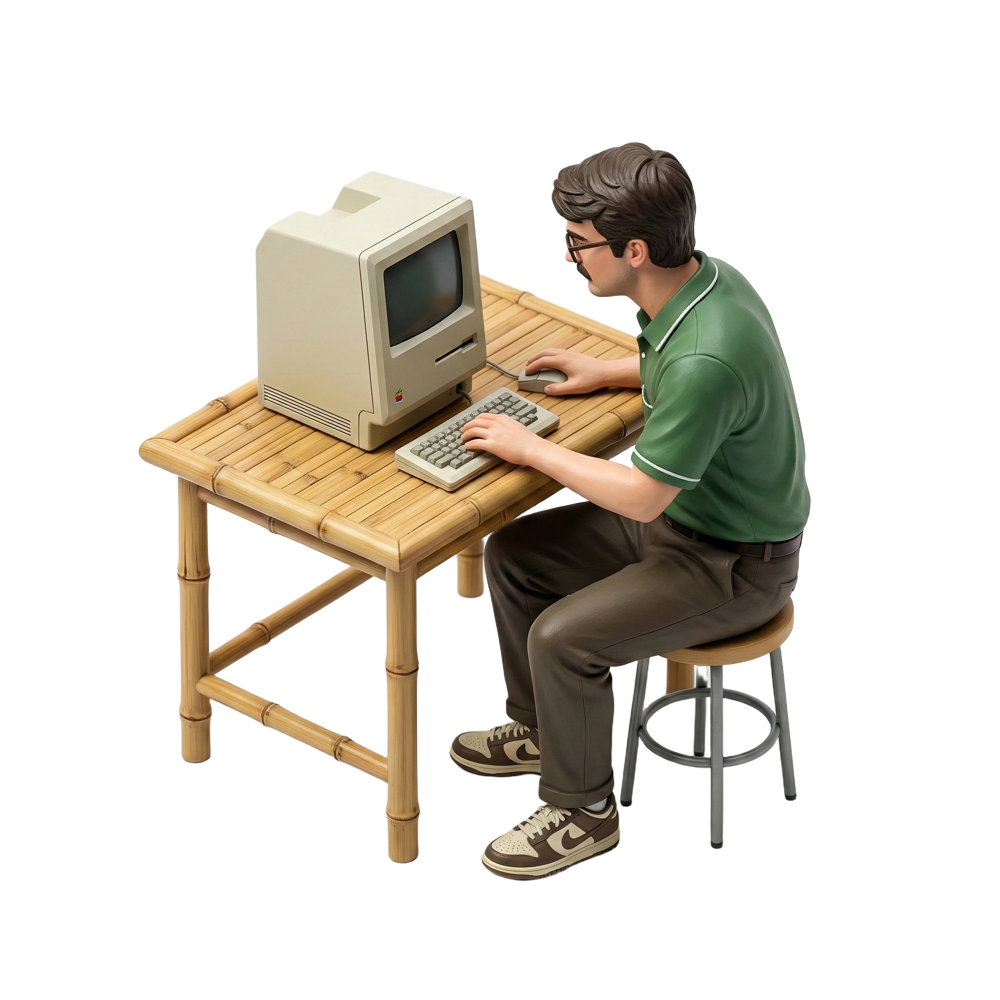
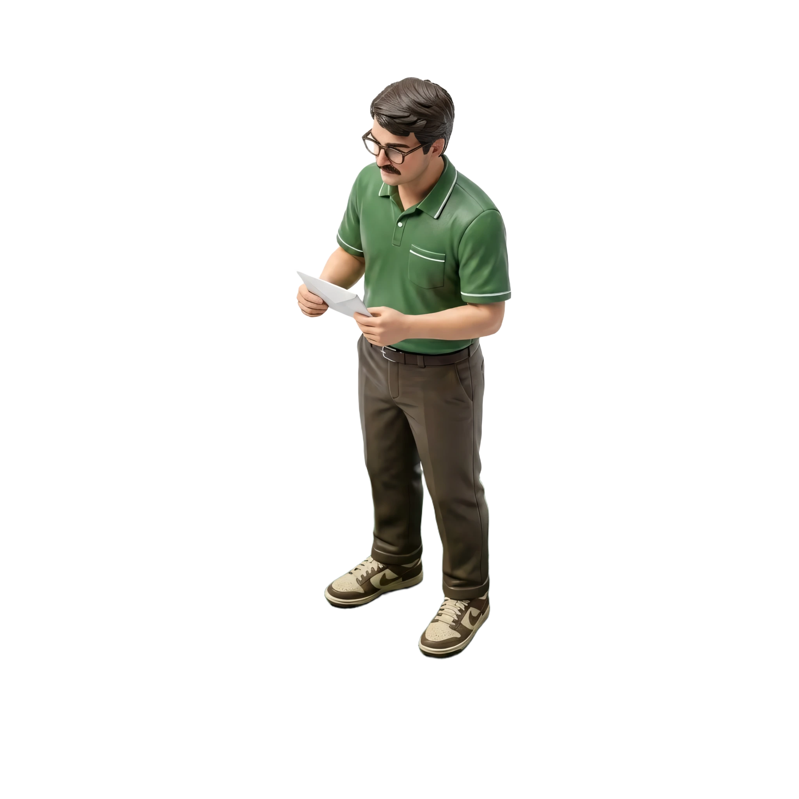

# SHAUGHV Design System

> A typographic-brutalist personal brand system recoloured in vintage tones — for **SHAUGHV** / Emmett Shaughnessy. Built to let design agents produce on-brand interfaces, slides, prototypes, and marketing assets without re-discovering the rules every time.

The system is the **intersection of two living codebases**: the brutalist motion-forward identity of [emmetts_personal_website](https://github.com/RealEmmettS/emmetts_personal_website) recoloured against the cream-and-sage palette of [shaughv_vintage](https://github.com/RealEmmettS/shaughv_vintage). Open both for deeper context — they are the source of truth.

---

## Index

| File / folder | What's in it |
|---|---|
| `README.md` | This document — brand context, content fundamentals, visual foundations, iconography |
| `SKILL.md` | Agent-skill front-matter so this folder can be loaded as a Claude Skill |
| `BRANDMARK.md` | **How to render and animate the SHAUGHV mark in any framework.** Decision tree, drop-in usage, full animation spec, porting checklist. Read this before placing the mark anywhere. |
| `colors_and_type.css` | All design tokens — `@font-face` declarations, palette, semantic vars, type classes. **The single source of truth for visual atoms.** |
| `fonts/` | Self-hosted webfonts (Makira, Gail Rock) — `.woff2` |
| `assets/` | SHAUGHV brandmarks (static SVG + PNG variants), the **vanilla JS animated drop-in** (`animated-brand-mark.js`), the **React/Framer port** (`AnimatedBrandMark.jsx`), the **canonical loader** (`shaughv-loader.js`), and the **vintage figurine library** (`assets/figurines/` — optional, vintage-only) |
| `preview/` | Small HTML cards rendered in the Design System tab (one specimen per token cluster) |
| `ui_kits/personal_site/` | Hi-fi recreation of `emmettshaughnessy.com` — the canonical brutalist surface |
| `ui_kits/vintage_site/` | Hi-fi recreation of `shaughv_vintage` — the same brand, vintage edition |

---

## Brand at a glance

**SHAUGHV** is the personal brand mark of **Emmett Shaughnessy** — software developer, educator, and founder. The mark itself is a wordmark with a hidden glasses-and-mustache motif baked into the **A**-and-letterforms — a half-portrait, half-typographic logotype.

There are **two living surfaces** under the same name:

1. **emmettshaughnessy.com** — the primary canonical surface. *Brutalist, typography-first, dark-by-default, motion-forward.* Locked to a near-black background with a single signal-color orange (`#FF5E1A`).
2. **shaughv_vintage** — an alternate, lower-key vintage edition. *Bauhaus-inspired, cream-and-sage, figurine illustrations, serif display.* Uses the same SHAUGHV mark, recoloured.

This design system uses **the layout, motion language, and component DNA of the personal site**, paired with **the cream + sage + olive + bamboo palette of the vintage edition**. It is intentionally a hybrid — produced specifically to brand outputs that need to feel less aggressive than the live dark site.

> The original brand orange (`#FF5E1A`) is preserved as `--sv-brand-orange` for hosted media (logo files, the SHAUGHV ad video, favicons) and the orange-variant lockup. **Sage (`#5B8A5B`) is the action color in this system.** Use orange only when surfacing official brand assets.

---

## CONTENT FUNDAMENTALS

How copy is written across SHAUGHV surfaces.

### Voice

**Confident, dry, slightly understated.** A craftsman talking about work, not a brand evangelizing itself. Sentences are short and decisive. No exclamation marks except as wry punctuation. No "we" — SHAUGHV is one person.

### Pronouns

- **First person singular** (`I`, `my`, `me`) — about the work and about availability.
- **Second person** (`you`, `your`) — addressed only when asking the reader to act (CTAs, contact prompts).
- **Never "we"** unless quoting a client.

### Casing rules

This is the most distinctive part of the system — it's intentionally bimodal:

| Class | Rule | Examples |
|---|---|---|
| **UPPERCASE** | Headlines, section titles, nav, buttons, eyebrows, labels, work-tile titles, tech pills, skill items | `SELECTED WORKS`, `VIEW SELECTED WORKS`, `DIGITAL CRAFTSMAN`, `INDEX 001 — 027` |
| **Sentence case** | Body copy, descriptions, principles, footer prose | "Software developer, educator, and founder…" |
| **lowercase.tld** | Domain references in /works | `tikset.com`, `reports.qubetx.com` |

Apply uppercase via CSS (`text-transform: uppercase`), not in source — preserves screen-reader pronunciation.

### Tone examples (literal copy in production)

- **Hero eyebrow:** `Digital Craftsman` — the SHAUGHV positioning, always uppercase.
- **Hero body:** *"Software developer, educator, and founder. I've been shipping apps and teaching technology since 2017 — and I'm just getting started."*
- **About card:** *"I am a web developer and designer with a passion for creating functional, minimalist, and interactive digital experiences."*
- **Vintage tagline:** *"I make websites that look good and actually work. Currently hunting for my next project."*
- **Principles:** *"Less but better — ship intentional interfaces."* / *"Prototype, validate, and refine quickly."*
- **CTA copy:** `VIEW SELECTED WORKS`, `GET IN TOUCH`, `SEE MORE WORKS →`
- **404 (vintage):** *"Oops. This page doesn't exist. No worries, head back home and we'll get you sorted."*

### Punctuation

- Em-dashes used freely with **thin hair spaces around them** (`&thinsp;&mdash;&thinsp;` or `&nbsp;—&nbsp;`).
- "**/**" used as a glyph separator — often coloured `--accent` so it pops (`Every / thing Shipped.`, `email / LinkedIn / GitHub`).
- "**◆**" used as a marquee separator in the orange ticker on /works.
- Periods used as terminal emphasis on hero phrases (`Every / thing Shipped.`).

### Emoji

**Never.** No emoji in production copy or UI. Iconography lives in `lucide-react` (line icons) and SVG brand assets. The closest thing to a "fun" character is the `◆` rhombus separator.

### Vibe

Opening-title-sequence energy, not startup dashboard. Slightly theatrical. Confident enough to use a single CTA per screen. Comfortable with long pauses (full-screen hero, single sentence). Industrial-mono small text. Generous letter-spacing on all metadata.

---

## VISUAL FOUNDATIONS

The non-negotiable visual rules. See `colors_and_type.css` for the underlying tokens.

### Palette

| Role | Token | Hex | Where it lives |
|---|---|---|---|
| Background | `--bg` | `#F5F5F0` | Page gradient: cream-200 → cream-100 → cream-200 |
| Raised surface | `--bg-raised` | `#FAFAF8` | Cards, panels, navbar fills |
| Foreground | `--fg` | `#5C5446` | Body copy, headings, hairlines |
| **Primary accent** | `--accent` | `#5B8A5B` (sage) | CTAs, focus, selection, /works ticker glyphs |
| Warm secondary | `--warm` | `#C4A876` (bamboo) | Figurine backdrops, illustration tones |
| Bauhaus red | `--sv-bauhaus-red` | `#BE3A34` | Bauhaus primitive blocks (sparingly) |
| Bauhaus blue | `--sv-bauhaus-blue` | `#1E4B8E` | Bauhaus primitive blocks (sparingly) |
| Bauhaus yellow | `--sv-bauhaus-yellow` | `#E8B923` | Bauhaus primitive blocks (sparingly) |
| Brand orange (legacy) | `--sv-brand-orange` | `#FF5E1A` | Only on hosted brand media |

**Rule:** never introduce raw hex values in components. Add to `colors_and_type.css` first.

### Type

| Role | Family | Where |
|---|---|---|
| Display + headings | **Makira** (proprietary sans) | `h1`–`h4`, billboard hero, section titles |
| Body / UI | **Makira** (proprietary sans) | Default body, paragraphs, form inputs |
| Mono / metadata | **Gail Rock** (proprietary mono) | Labels, eyebrows, tech pills, index numbers, code |

Two families, and only two. Both are `standard` on the SHAUGHV CDN and ship in its combined bundle. **IBM Plex Mono and Unbounded are opt-in** there and are no longer part of the default system — link them explicitly if a surface genuinely needs one.

Aggressive type-step policy: reserve `2xl:` (≥1536 px) for billboard sizes. 13″ laptops at 1280 px should land on the penultimate step.

### Spacing & layout

- **Container:** `max-width: 1920px`, `padding-x: clamp(1.5rem, 5vw, 3rem)`.
- **Section padding:** `padding-y: clamp(4rem, 9vw, 8rem)` (use `--section-py`). Default is roomy — sections breathe.
- **Grids:** asymmetric 12-col is the default. Common spans are `1 / 4 / 6 / 1` (project rows) and `8 + 4` (works-hero counter).
- **Radii:** **square by default.** Pills (`9999px`) only for chips and icon-button circles. `20px` / `32px` reserved for the contact-form-style outer wrappers.

### Backgrounds & surfaces

- **Page:** cream gradient, vertical. Not flat — there's a subtle warmth bias toward cream-200 at the edges.
- **Full-bleed images:** never. Imagery is windowed inside bordered frames, default `grayscale` filter, fades to color on hover.
- **No textures, no patterns, no noise**, with one exception: the **DotMatrix** canvas — a fixed full-viewport background of 1.5px dots on a 30px grid, magnetically attracted to the cursor within a 150px radius. 22% opacity. Sage on cream.
- **Bauhaus primitives** (`BauhausCircle`, `BauhausLine`) at 5–20% opacity behind hero / about sections. Never inside content; always behind.

### Borders & dividers

- **Default:** 1px solid `--border-hairline` (olive @ 18%). Used everywhere a separator is needed.
- **Strong:** 1px solid `--border-strong` (full olive) on project rows, work tiles, filter bar, top/bottom rules.
- **Accent stripe:** `border-l` of `--accent` on Skills columns and quote blocks.
- Fine `h-px` hairlines with `bg-gradient-to-r from-transparent via-fg/20 to-transparent` for centred section dividers.

### Shadows

Shadows are **rare** — depth is structural (borders + spacing), not floating. Two exceptions:

| Shadow | Value | Used on |
|---|---|---|
| Card lift | `0 6px 24px rgba(92,84,70,0.08)` | About cards, raised panels |
| Glass float | `0 30px 80px rgba(32,79,32,0.12)` + `backdrop-blur(xl)` | Contact form panel |

No inner shadows, no glow effects, no neumorphic dimensionality.

### Gradients

Used **only** as atmospheric **radial-gradient overlays** behind hero / about / contact:

```css
background:
  radial-gradient(circle at 15% 20%, rgba(91,138,91,0.12), transparent 42%),
  radial-gradient(circle at 85% 15%, rgba(196,168,118,0.10), transparent 40%),
  radial-gradient(circle at 45% 90%, rgba(91,138,91,0.08), transparent 45%);
```

Never as button fills, never as text fills, never as full-bleed backgrounds.

### Animation & motion

Motion is **decisive and brief** — never decorative.

| Pattern | Tokens | Used for |
|---|---|---|
| Stagger reveal | `--ease-brutalist` (`cubic-bezier(0.16, 1, 0.3, 1)`), `staggerChildren: 0.1`, `duration: 0.8s` | Hero container, WorksHero, Projects rows |
| `whileInView` fade-slide | `y: 50→0`, `duration: 0.6s`, `viewport: { once: true }` | Project rows, skill columns, work tiles |
| Per-character glitch | Phase-lock intro: ghost → flicker → lock; affinity-biased random glyph swaps | Hero name only |
| Text scramble on hover | Anime.js `useTextScramble`, 520ms `outQuad`, glyph pool `A–Z0–9/.-` | Project titles, work-tile domain headings, hero eyebrow |
| Count-up | Anime.js, 1.2–1.4s `outExpo`, zero-padded | /works counter (`000 → 027`) |
| Smooth scroll | Lenis, `duration: 1.1`, with anchor-snap on desktop (proximity, 40% threshold) | Global |
| Marquee ticker | `translateX(0 → -50%)`, 50s linear infinite (25s on mobile) | /works domain ticker |
| Layout spring | Framer `layoutId` with `type: spring, stiffness: 400, damping: 40` | Filter-chip active-bg slide |

**Easing rules:**
- Use `--ease-brutalist` for hero / headline reveals.
- Use `--ease-out-cubic` for everything else (button hovers, transitions).
- No bounces. No springs on hover transitions. Springs only on layout-id morphs.

### Hover states

| Element | Default | Hover |
|---|---|---|
| Nav links | `--fg` (olive) | `--accent` (sage) |
| Primary CTA | sage bg + cream text | olive bg + cream text |
| Secondary CTA | olive bordered, transparent | sage border + sage text |
| Ghost CTA | sage text | bamboo text |
| Project row | transparent + grayscale image | olive bg + cream text + image full color + `scale-105` |
| Work tile | olive border, transparent | olive bg + cream text + image reveals at 25% |
| Tech pill (in row) | `current-color` border | sage bg + sage border + cream text |
| Icon button | bordered circle, current-color | sage fill + cream icon |
| Filter chip (inactive) | olive border, transparent | olive bg + cream text |
| Filter chip (active) | sage bg + cream text (animated `layoutId`) | — |

**Press states:** subtle scale (`active:scale-95`). No color shift on press.

### Transparency & blur

- `backdrop-blur-md` on the sticky `/works` filter bar over `bg-background/85`.
- `backdrop-blur-xl` on the Contact form glass.
- Otherwise, **no `backdrop-filter` usage.** Body text and cards stay opaque.

### Imagery treatment

- All project imagery is `webp`, full-bleed inside a bordered frame, **default `filter: grayscale(1)`**.
- On row/tile hover, transitions to `grayscale(0)` with `scale(1.05)` over 700ms.
- Imagery on work tiles is **always `aria-hidden`** — decorative, never content.
- Mood: warm-bias, photographic, never illustrated except for the **figurine** illustrations in `assets/figurines/` — a vintage-only set of character renders of "Shaughv at a desk". **Use of figurines is optional.** See the Iconography section for the placement rules.

### Layout fixed elements

- **Navbar:** `fixed top-0 z-50`, transparent, uses `mix-blend-difference` against the cream background. White text.
- **CustomCursor:** `fixed`, `z-9999`, sage dot, `mix-blend-difference`, spring physics.
- **DotMatrix:** `fixed inset-0 z-[-1]`, pointer-events-none.
- Everything else scrolls.

---

## ICONOGRAPHY

The brand uses **two icon resources**:

1. **`lucide-react`** — the line-icon system used throughout `emmettshaughnessy.com`. Stroke-based, 24px default, 2px stroke, rounded line-caps. Examples used in production:
   - `ArrowUpRight` — every external link
   - `ArrowLeft` / `ArrowRight` — primary navigation
   - `Menu` / `X` — mobile nav toggle
   - `Search` — /works search input
   - `ChevronDown` — deprecated-works drawer accordion

   In throwaway HTML artifacts, load Lucide from CDN:
   ```html
   <script src="https://unpkg.com/lucide@latest"></script>
   <i data-lucide="arrow-up-right"></i>
   <script>lucide.createIcons();</script>
   ```

2. **The SHAUGHV brand mark** — a custom SVG wordmark with hidden glasses-and-mustache motif. **Always animated when the framework can run JS; static otherwise.** Full spec in [`BRANDMARK.md`](./BRANDMARK.md).

   | File | Use |
   |---|---|
   | `assets/animated-brand-mark.js` | **Vanilla JS drop-in — the default**. One `<script>` tag + a `<shaughv-mark>` element (or `[data-shaughv-mark]`). No dependencies. Honors `prefers-reduced-motion`. |
   | `assets/AnimatedBrandMark.jsx` | React + Framer Motion port. Drop into any codebase already using `framer-motion`. |
   | `assets/SHAUGHV-Official.svg` | **Static fallback** wordmark, monochrome `currentColor`. Use whenever the consumer can't run JS (PPTX, PDF, generated images, plain markdown). |
   | `assets/SHAUGHV-Green.png` | Sage-coloured lockup PNG — only when the consumer can't render SVG at all. |
   | `assets/SHAUGHV-Orange.png` | Brand-orange lockup PNG — only when the consumer can't render SVG at all. |
   | `assets/SHAUGHV-Favicon-Light.svg` / `-Dark.svg` / `-*-Alt.svg` | 1:1 **icon mark** (mustache + glasses only, no letters) — use at favicon / ≤ 48 px scale, where the wordmark is illegible. |

   **Default placement:** top-left of every primary SHAUGHV surface (navbar / header), **40–64 px tall**, color inherited from the surrounding lockup via `currentColor`. On the live navbar the loop is: wordmark holds 10 s → undraws → 3 s pause → mustache + glasses icon draws → holds 10 s → undraws → 3 s pause → wordmark redraws → loop. See `BRANDMARK.md` for the full timing table and animation recipe.

   **When the target framework cannot run the JS drop-in** (slide exports, PDF, image consumers, frameworks where you cannot mount a real DOM node), fall back to embedding `assets/SHAUGHV-Official.svg` directly — it is the source-of-truth static wordmark and works anywhere SVG works.

**Rules:**
- **Never draw your own SVG icons.** If a glyph isn't in Lucide, use a Lucide stand-in or omit.
- **Never use emoji as iconography** (or anywhere — see Content Fundamentals).
- **Never use Unicode characters as icons** with one exception: `◆` (`\u25C6`) as a marquee separator in the orange brand color.
- Brand mark uses `currentColor` and must inherit text colour — don't hardcode it.

---

## LOADER (required, all surfaces)

Any SHAUGHV surface that shows a loading state — full-page boot, route transition, async work, image lazy-load, suspense fallback — uses **the canonical SHAUGHV loader** (a packaged version of loader #47 from the SHAUGHV loaders library: "Portrait ↔ blob morph"). The mustache + glasses brandmark fills its lenses, drains, then dissolves through a soft goo filter into a wandering organic blob that drifts for ~4 s before morphing back into an empty portrait. ~12 s loop.

**This is non-negotiable.** Do not substitute a framework default (`<CircularProgress />`, Tailwind's `animate-spin`, a custom dots indicator, etc) or pick a different loader from the SHAUGHV loaders library. There is one loader.

### How to use it

```html
<!-- color flows in from the host element's CSS `color` property -->
<shaughv-loader style="color: var(--accent); height: 120px;"></shaughv-loader>
<script src="assets/shaughv-loader.js"></script>
```

That's it. The component:
- Is a vanilla custom element — no framework dependency.
- Auto-loads `anime.js` v3.2.2 from jsDelivr on first mount.
- Runs in a shadow root, so the goo filter and clip-paths don't collide if you mount more than one on a page.
- Honors `prefers-reduced-motion: reduce` by rendering the static portrait.

### What you can change

**Only the color.** Set the host element's CSS `color` to any palette token (`var(--accent)`, `var(--fg)`, `var(--sv-brand-orange)`, etc) and the loader inherits it through `currentColor`. Default is sage.

Geometry, timing, the goo filter, the morph choreography, and the wave animation are locked — they are part of the brand expression. If something feels wrong at your size, change the host element's `height`/`width`, not the loader's internals.

### Sizing & placement

- **Full-page / boot:** 120–180 px tall, centered in viewport.
- **Inline / section:** 80–120 px tall, aligned to the surrounding rhythm.
- **Surfaces narrower than 120 px or loads expected to resolve in under ~2 s:** prefer the brand-mark icon variant (`<shaughv-mark icon-only>`) — the full morph reads as theatrical at small sizes.

Pair the loader with the same content discipline as the rest of the brand: a single line of label text below (mono, uppercase, sage), no spinner-plus-percentage compound widgets, no "Loading…" with trailing dots animation.

---

## FIGURINES (optional, vintage edition only)

`assets/figurines/` ships five Gemini-rendered character illustrations of **Shaughv at a desk** — a stylised 3D-figurine of Emmett (mustache, glasses, green polo, brown chinos, Nike Dunks) posed with a beige toy Macintosh on a bamboo desk. They are the closest thing this brand has to a mascot.

### Figurines are OPTIONAL

**Do not add a figurine to every SHAUGHV surface.** They're a vintage-edition flourish, not a foundation:

- ✅ **Use them when** you're building on the **vintage cream palette** AND the layout has a natural slot for a hero illustration (split hero, contact CTA, 404, footer watermark, "look at this" callout next to a feature).
- ❌ **Skip them for** anything on the **brutalist dark surface** (`emmettshaughnessy.com` look); slide decks, dashboards, and dense data UIs; sites where the figurine would feel out of place (technical / professional / b2b contexts); and any surface where you'd otherwise add a placeholder rather than commit to imagery.

**When in doubt, leave them out.** A clean, type-forward cream layout is fully on-brand without a figurine. **Never use placeholders that imply a figurine "should" be there** — if you can't justify the figurine, redesign the section around it.

### The library

All figurines ship in two variants: `assets/figurines/*.webp` (white background, matches paper-stock layouts) and `assets/figurines/transparent/*.webp` (alpha cutout, drops onto any background). **Prefer the transparent variant** unless you specifically want the paper-stock backdrop. (Source PNGs were converted to WebP to keep the design system lightweight — same visuals, ~93% smaller.)

| File | Character | Use for |
|---|---|---|
| `figurine-header.webp` | Working — typing at the Mac, side profile | Hero / landing splits, "currently working on" sections |
| `figurine-look-at-this.webp` | Pointing at the screen, eyes wide, facing camera | Project highlight, "look at this" callouts, feature reveals |
| `figurine-footer.webp` | Standing next to the desk, hands in pockets, content | Footer watermark, closing brand presence, about-card sidekick |
| `figurine-404.webp` | Head in hands, frustrated at the screen | 404 / error pages, empty states, "this didn't work" moments |
| `figurine-mail.webp` | Standing, reading a letter (no desk) | Contact CTA, mailto blocks, newsletter sections |

### Placement rules

- **Always against a cream-family background** — never on the brutalist near-black surface; the figurines were rendered on a cream colorspace and the highlights/shadows fall apart in dark mode.
- **Generous breathing room.** Figurines are illustrative, not decorative — they need a windowed plate (1px olive border + bamboo/sage wash background) or at least 80px of cream airspace around them. Don't tuck them into dense layouts.
- **Sized 320–560px** on the long edge in production. Below 240px the facial detail collapses; above 720px the figure starts to feel like clip-art.
- **Pair with Bauhaus primitives** when on a windowed plate — soft bamboo or sage circles behind the figurine reinforce the vintage stage. Keep the primitives at 18–22% opacity so the figurine reads first.
- **Never tint, recolor, duotone, or filter** the figurines. They are rendered art, not vector marks. Don't apply `grayscale()`, `hue-rotate`, or `mix-blend-mode`. If you need a different palette, you're using the wrong asset.
- **Alt text is required** and should describe the pose (`"Figurine of Shaughv pointing at his vintage Mac."`) — these are character illustrations, not decoration, when used in marketing copy.

### How to use them

```html
<!-- Hero / split layout -->


<!-- Contact section, with a windowed plate -->
<div style="border: 1px solid var(--fg); background: rgba(250,250,248,0.82); padding: 32px;">
  
</div>
```

See `ui_kits/vintage_site/HeroSection.jsx` for the canonical windowed-plate treatment.

---

## Source repos

The two living codebases this system is distilled from:

- **[`RealEmmettS/emmetts_personal_website`](https://github.com/RealEmmettS/emmetts_personal_website)** — the canonical brutalist brand surface. Read `DESIGN_SYSTEM.md` and `README.md` in that repo for the deepest specification — particularly section, motion, and accessibility details that don't fit here.
- **[`RealEmmettS/shaughv_vintage`](https://github.com/RealEmmettS/shaughv_vintage)** — the vintage-edition palette source. Cream + sage + olive + bamboo, Bauhaus primitives, figurine illustrations. Read `tailwind.config.ts` and the `sections/` directory.

If you're working on something that needs more pixel-perfect fidelity than this system captures, **open those repos directly**. This design system is a faithful abstraction, not a clone.

---

## Font substitution notes

Both families the system needs — **Makira** (400–900) and **Gail Rock** (100–700) — ship in `fonts/` as `.woff2` with full weight coverage, so **no substitutions are required**. In production you can link the CDN bundle instead of copying the files:

```html
<link rel="stylesheet" href="https://cdn.shaughv.com/fonts/fonts.css">
```

Keep the local copies for anything sandboxed — Claude Artifacts' CSP blocks every external host, so a CDN-only page renders in fallback faces.

If a downstream consumer (e.g. PowerPoint export) can't load them:

- **Makira** → **Inter** (similar x-height, similar terminal shapes).
- **Gail Rock** → any true monospace; **IBM Plex Mono** is the closest match and remains available opt-in at `https://cdn.shaughv.com/fonts/ibm-plex-mono/ibm-plex-mono.css`.

### Gail Rock — things to know

Gail Rock replaced IBM Plex Mono as the mono face. It is genuinely fixed-pitch (every glyph advances `0.650em`), so tabular metadata and code align. Four differences from Plex are worth designing around:

| | Detail |
|---|---|
| **~8% wider** | `0.650em` per glyph vs Plex's `0.600em`. Mono text runs wider at the same `font-size` — check fixed-width labels, pills, and table columns. |
| **No italic** | Normal style only, so `<em>` in a mono context gets a synthesized oblique. Prefer color or tracking for emphasis. |
| **No backtick** | U+0060 is absent; the `ui-monospace` fallback in `--font-mono` picks it up automatically. |
| **No `→`** | U+2192 is absent (Plex had it). Use an em-dash or the `◆` separator, which no SHAUGHV face carries anyway. |
