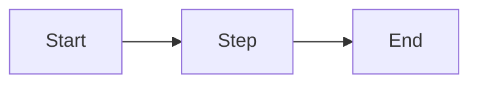
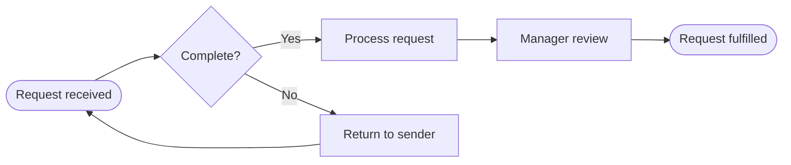
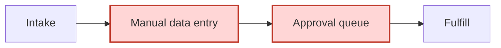
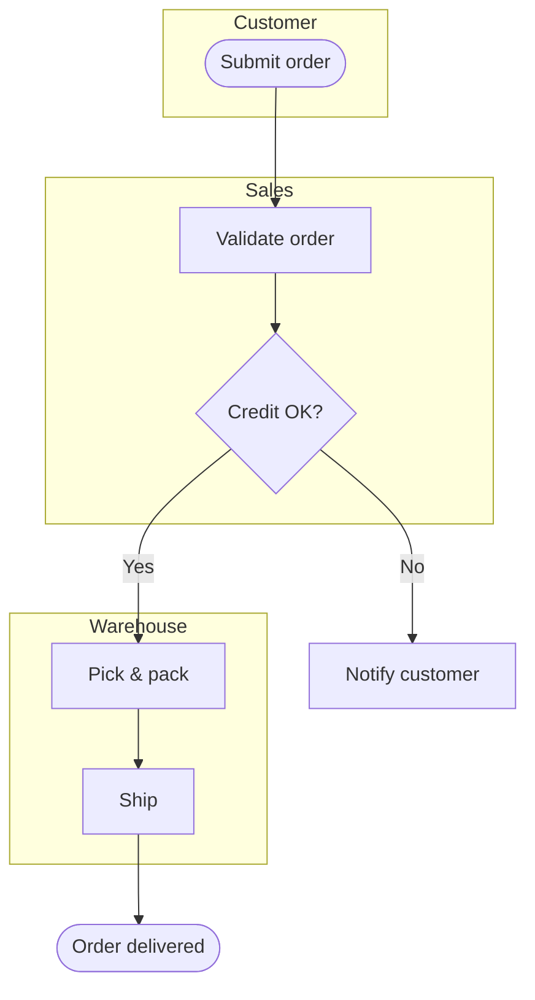
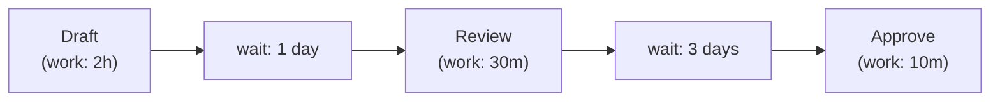
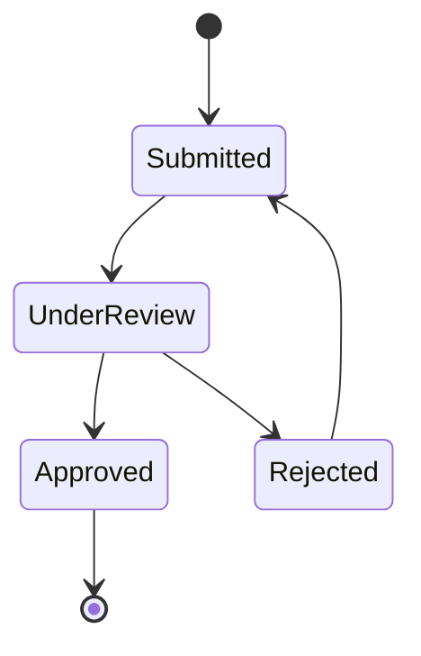

# Diagramming Workflows

This file gives the skill what it needs to **consistently** produce workflow
diagrams: how to choose the diagram type, exact Mermaid syntax for each, and how to
output it so it renders.

A diagram is produced in **Step 5 (Converge)** — after the Sweep has informed it.
(A rough text step-list is enough for Step 3.) The diagram should show the *actual*
workflow, including the bottlenecks, branches, and hand-offs the Sweep revealed.

---

## How to output a diagram so it renders

This environment renders **Mermaid** natively. Output the diagram as a fenced code
block with the language tag `mermaid`:

````

````

Two ways to deliver it:
- **Inline in chat** — a fenced `mermaid` block renders directly in the
  conversation. Best for a diagram the user reads and reacts to in the turn.
- **As a file** — if the user wants to keep or share it, save a `.mermaid` file (or
  embed the block in a `.md` file) to a location the user names (or the session's
  outputs folder, if the environment provides one) and present it.

Always validate the syntax mentally before sending — an unparseable block renders
as an error, not a diagram. Keep node IDs short and alphanumeric; put readable
text in the brackets.

## Choosing the diagram type

| Situation | Diagram type | Why |
|-----------|--------------|-----|
| A straightforward sequence of steps, maybe with a few decisions | **Flowchart** | Simplest, most universal. The default. |
| Multiple people / teams / systems, and *who does what* matters | **Swimlane** (flowchart with subgraphs) | Makes hand-offs between actors visible — and hand-offs are a key finding for Lean, BPR, TOC. |
| You want to show value-adding vs. waiting/waste time | **Value-Stream-style flowchart** | Annotate each step with time; expose the ratio of value-add to wait. Lean's signature view. |
| The workflow is really a set of states an item moves through | **State diagram** | Good for things like a ticket, application, or order changing status. |
| A high-level scope frame before detailing | **SIPOC block** | Suppliers → Inputs → Process → Outputs → Customers. Frames boundaries. |

When in doubt, use a **flowchart**, and add **swimlanes** if more than one actor is
involved. Match the diagram to what the workflow actually is — do not force a
fancy type where a plain flowchart communicates better.

---

## Mermaid syntax — Flowchart

`flowchart LR` is left-to-right; `flowchart TD` is top-down. Use LR for long
sequences, TD for branch-heavy ones.



Node shapes carry meaning — use them consistently:
- `([text])` — rounded: start / end points.
- `[text]` — rectangle: a normal process step.
- `{text}` — diamond: a decision / branch point.
- `[/text/]` — parallelogram: an input or output (data, document).
- `[(text)]` — cylinder: a data store / database.

Edges: `-->` a flow; `-->|label|` a labelled flow (use for decision branches and
hand-offs).

### Marking findings on the diagram

To make the Sweep visible, highlight problem steps with a class:



This visually flags, e.g., a TOC constraint or a Lean waste right on the map.

## Mermaid syntax — Swimlane (actors as subgraphs)

Mermaid has no native swimlane; represent each actor as a `subgraph`:



Each `subgraph` is a lane; flows crossing lanes are the hand-offs. Count them — a
high cross-lane count is itself a BPR/Lean finding.

## Mermaid syntax — Value-Stream-style flowchart

Annotate each step with process time and the wait before it, so value-add vs.
waste is visible:



Then state the ratio explicitly in prose, e.g. "value-adding time ≈ 2h40m against
~4 days of wait — under 3% of lead time is value-adding." That number is a
powerful Lean finding.

## Mermaid syntax — State diagram

For an item moving through statuses:



## SIPOC block

A SIPOC is best shown as a simple table rather than a diagram:

```
| Suppliers | Inputs | Process | Outputs | Customers |
|-----------|--------|---------|---------|-----------|
| ...       | ...    | step 1 → step 2 → step 3 | ... | ... |
```

---

## Quality bar for the diagram

Before presenting the diagram, confirm:
- It reflects the *real* workflow as corrected by the user in Step 3 — not an
  idealized version.
- The diagram type fits the workflow (flowchart unless multiple actors → swimlane,
  or time-analysis → value-stream).
- Decision points are diamonds; start/end are rounded; data stores are cylinders.
- Findings from the Sweep (bottlenecks, waste, constraints) are visually flagged.
- The Mermaid syntax is valid and will render.
- The diagram is readable — if it has more than ~15–20 nodes, consider a
  high-level diagram plus a detailed sub-diagram rather than one dense map.
